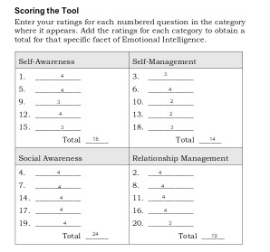

# Upgrade your technical skills with deliberate practice
[The Article](https://web.archive.org/web/20160616225417/http://www.happybearsoftware.com/upgrade-your-technical-skills-with-deliberate-practice)
 If you want to Improve your technical skills you have to make your self into the mud where mud is problems/Challenges/New things . you do it so you could learn otherwise you will hit  plateau of your learning journey as a developer so you should practice often and learn new things.

# The power of believing that you can improve
[Carol Dweck on the Growth Mindset](https://www.ted.com/talks/carol_dweck_the_power_of_believing_that_you_can_improve?language=en)
 This was a great ted talk! Carol Dweck is a Psychologist who studies why people succeed or don't and how to foster success. During her studies she found a school that instead issuing a failing grade they issued a **Not Yet**. This is so optimistic. I right away like the sound of "Not Yet" over F for failure. Preventing bad emmotions that affected by grading the students and they would STUDY rather than CHEATING. Really Teaching kids/youth to beliving in themself and they can improve, and raise them this way. This really can make someone see the hope on the otherside of a bad grade or situation. 

# Grit: The power of passion and perseverance
[Intelligence](https://www.ted.com/talks/angela_lee_duckworth_grit_the_power_of_passion_and_perseverance)
Social Intelligence, good looks, physical health and IQ of a person won't indecate if he is successful or gonna be . the predictor of success is **Grit**.Just the willingness to keep going, the stamina, the grit to succeed. Grit has no relation to talent / money or the previous inicators. If you have the grit you can do whatever you set your mind into, nothing else matters if you have the grit you improve and achive . if you are taleted or not it won't matter . So we can improve our Growth mindset with Grit and also Carol Dweck studies.
# A kinder, gentler philosophy of success
[Alain de Botton on Redefining Success](https://www.ted.com/talks/alain_de_botton_a_kinder_gentler_philosophy_of_success)
 The main points he talks about leads to success and failure. Success comes with a cost. You are unable to succeed at everything, and when you are successful are one element of life there is another element at loss. Being successful might not mean what we think, and what we want to be. As humans we take in a lot of information from all sources: radio, tv, people, etc... This defines how we view ourselves. "Highly open to suggestions". Ensure we are choosing our own idea of success. Some Advices i took :
 - Try to stay away from snob and envy people .
 -don't judge people by any standard.
 
 # EMOTIONAL INTELLIGENCE SELF-ASSESSMENT TOOL
[You can do it by Yourself ](https://codefellows.github.io/common_curriculum/career_coaching/201/emotional-intelligence-assessment.pdf)
I belive i tired my Best to answer it hoenstly. According to the results i need to work on my self-managment so i can improve. also i have to keep my other emotions on contorl.On the othe hand, I have excellent Self/Social- Awareness and Relationship Managment from my experience of life .

# Bias Self-Assessment
p
[You can do it by Yourself ](https://codefellows.github.io/common_curriculum/career_coaching/301/bias-assessment.pdf)
My score in the test was 96 .my stongest topic was Bias and identity,empathy and curiosity .My weakest was the connection to Mitiage bias so i should work on it and Four ways to act also a topic needs to improve beside the whole Improvment process 