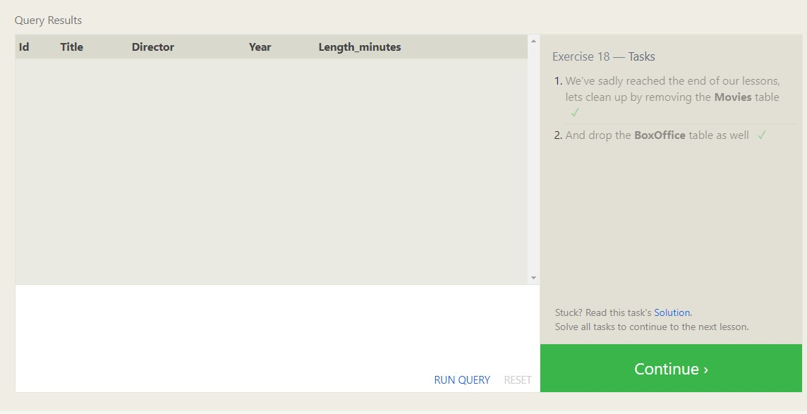

[:arrow_backward:](../README.md)
# SQL Queries

**SQL stands for *Structured Query Language***  
***We can use SQL to acces and manipulate databases , in multiple ways***

## SQL In Website
We use SQL in website to show data from a database. 
> you will need:  
> -An RDBMS database program (i.e. MS Access, SQL Server, MySQL).  
> -To use a server-side scripting language, like PHP or ASP.  
> -To use SQL to get the data you want.  
> -To use HTML / CSS to style the page.
## SQL Data Types
> Data types and ranges for Microsoft Access, MySQL and SQL Server. [W3SCHOOLS](https://www.w3schools.com/sql/sql_datatypes.asp)
--------------------------------------------
## SELECT Statement
**We use SELECT** to retrive data from SQL database .
   SELECT * FROM table_name;
>This way you will retrieve all the data form table_name we call * Splat.  
   SELECT column1,column2 FROM table_name.
>you can specify any amount of columns to retrive this way.   

 
## WHERE Clause
**We use Where** to filter through our data,using a specificed condition.
  SELECT column1 FROM table_name WHERE condition;  
> we can use it with **different statements** also not only in **SELECT**.  

**WHERE** cluase can be used witth different operators to achive it condition .
The operators :point_down:  
  

>Where clause can be used in much complex way to reach the specified condition also. It's a strong clause can be used alot so take a look for more complex operators.

  

>All strings must be quoted so that the query parser can distinguish words in the string from SQL keywords.  
## Filtering and sorting Query results
-----
### DISTINCT 
DISTINCT keyword will blindly remove duplicate rows
  SELECT DISTINCT column1, column2 FROM mytable
### ORDER BY clause  
will sort our results by a given column in ascending or descending
   SELECT * FROM table_name ORDER BY country, 2nd  ,third;  
>>seveal filtering
   SELECT column1 FROM table_name ORDER BY column1 ASC, column2 DESC;  
#### LIMIT and OFFSET
The **LIMIT** will reduce the number of rows to return, **OFFSET** will specify where to begin counting the number rows from.
### JOINs
>There are different types of SQL joins https://www.w3schools.com/sql/sql_join.asp
  

Using the JOIN clause in a query, we can combine row data across two separate tables using a unique key which is mostly the id.
    SELECT * FROM table1 JOIN table2 ON table2.column2 = table1.column1 

     
  
  
  
  
  
----
# Database Management
Schema in SQL , is a database describes the structure of each table, and the datatypes that each column of the table can contain.
## CREATE TABLE statement
**CREATE TABLE** will create a new database table.  
  CREATE TABLE IF NOT EXISTS Parts ( 
    id INTEGER ,
    description TEXT ,
    price FLOAT,
  );
> The above code will Create a table for the parts as following 
>| id |  description  | price|
|:-:|:-:|:-:|
|  INTEGER |  TEXT | FLOAT  |  

  

## DROP statement    
will delete the database table **IF EXISTS**  

   DROP TABLE IF EXISTS mytable;

## INSERT statement
**using this statement** you add rows into the tables specifying every column values.
   INSERT INTO mytable VALUES (value_or_expr, another_value_or_expr, …), (value_or_expr_2, another_value_or_expr_2, …) ;  

## UPDATE statement
Updating values in your Database.  
   UPDATE table_name SET column= value,column2= value.. WHERE condition;

## DELETE rows
you can delete data from a table in the database using DELETE statement.
   DELETE FROM mytable WHERE condition;

## The "ALTER" statement
we use it to modify the schema itself (its tables and their constraints and data types)
    **ADD** statement
            ALTER TABLE parts ADD country TEXT DEFAULT 'Germany'
     >   this will add a new column country to the table with the type (TEXT) and has a default value of (Germany)  
     **DROP** statement
            ALTER TABLE parts DROP price
        this will delete the whole column (price)
        
        ---
    **RENAME** statement
            ALTER TABLE parts RENAME TO parts1
        this will rename the whole table to (parts2)

## SQL Constraints
SQL constraints are used to specify rules for the data in a table. 
> adviced to take a look at them https://www.w3schools.com/sql/sql_constraints.asp

